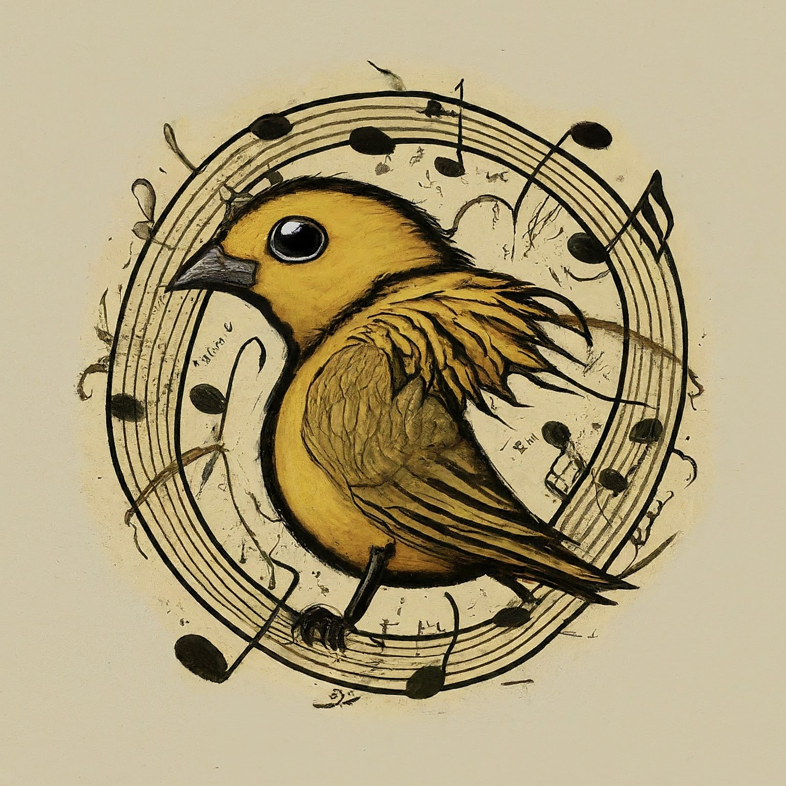
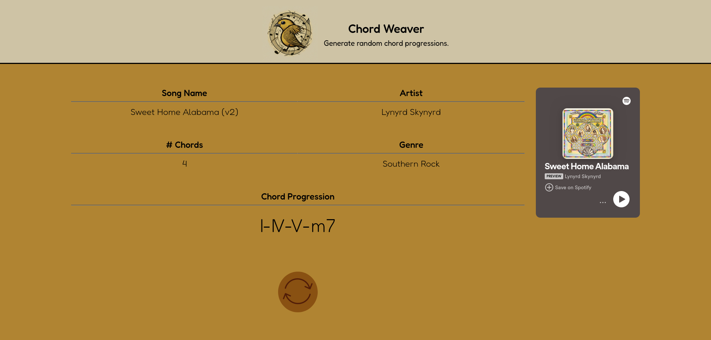
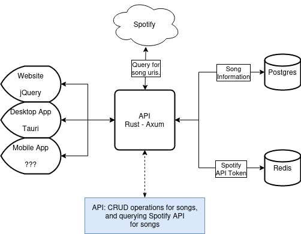
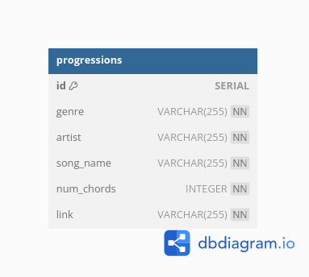

# Chord Weaver


A full-stack application for getting randomized chord progressions.



<hr>

## Project Information
I overengineered this for fun.

Sometimes the song shown with Spotify isn't correct because it queries the Spotify API on the fly from db song name and artist, and the db data isn't cleaned from the web scraping.

I think I made this in 3 or 4 days. Main sticking point was Rust API. Rust is ***slow*** to develop, and my impl is hacked together.
<hr>

## Getting Started
To run the project ensure you have docker and docker compose installed.

Start with the initialization script, `./initial_setup.sh`.

Then, run with `docker compose up`.

On first run, the api takes forever to compile. Note this if you go to the website.
<hr>

## Basic Project Structure
High level overview of the project components. <!-- this is a flow chart...? -->

<hr>

DB Diagram



*Note that **link** column is a reference to the original Internet Chord Database link.*
<hr>

Directory Layout
```
├── api <──────────────────────────────── Rust Axum REST API
├── cache <────────────────────────────── Redis Cache
├── chord-weaver.code-workspace <──────── VSCode Code Workspace
├── database <─────────────────────────── PostgreSQL Database / code to populate database
├── desktop <──────────────────────────── Rust Tauri Desktop Application
├── diagrams <─────────────────────────── Code to generate diagrams
├── docker-compose.yml <───────────────── Docker Compose Config to start whole project
├── mobile <───────────────────────────── Mobile Application (TODO)
├── readme-images <────────────────────── Readme Images
├── README.md <────────────────────────── Readme
├── tests <────────────────────────────── All tests throughout the project (WIP)
├── TODO.md <──────────────────────────── Todo List
└── website <──────────────────────────── HTML/JS/CSS/jQuery Website
```
<hr>

## Other Information
More information on the specific components can be found in each sub dir readmes.

All the information on the chord progressions comes from the [Internet Chord Database](https://internetchorddatabase.com/). It's scraped using Python and added to the DB.

The logo was made with [Gemini](https://gemini.google.com/), as was the name of the project. <!-- all hail the AI overlords -->

Draw.io was used for the project diagram.

dbdiagram.io was used for the db diagram. <!-- no sh*t -->